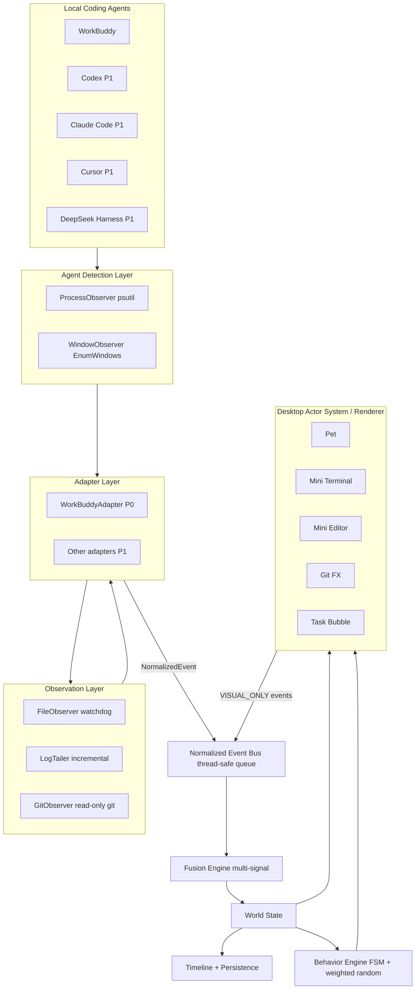
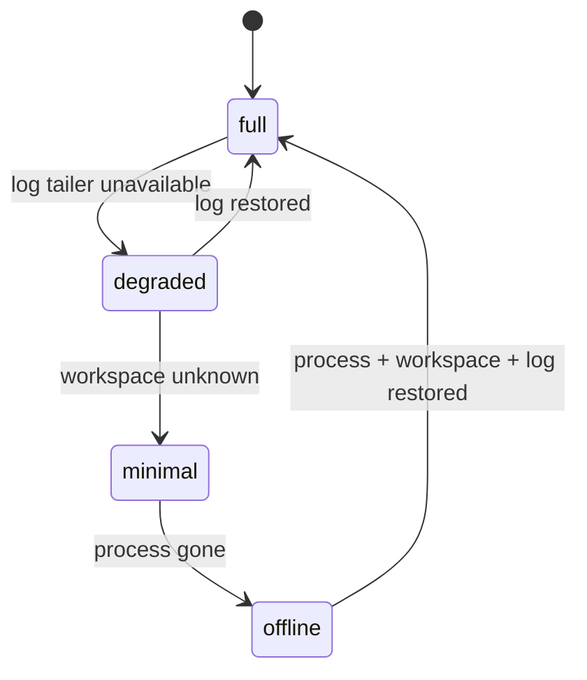

# AgentPet Architecture

Stack: **PySide6 + Python 3.13** (see [ADR-001](decisions/ADR-001-desktop-stack.md)).
Single process, GUI thread owns all widgets, observers run on worker threads.

## 1. Logical flow



## 2. Process / thread model

```
GUI thread        : QApplication, OverlayWindow (paints at 30fps, sleeps when static),
                    DebugPanel, SettingsDialog, QSystemTrayIcon
Observer threads  : ProcessObserver (1s poll), WorkBuddyLogTailer (0.4s poll),
                    SessionDbPoller (2s), FileObserver (native, event driven),
                    GitObserver (4s poll)
Handoff           : observers -> EventBus (queue.Queue) -> GUI drains on QTimer(16ms)
```

No observer ever touches a widget. Every crossing is a `NormalizedEvent`.

## 3. Package layout

```
apps/desktop/main.py          entry point, wires everything
agentpet/
  core/     config, logging, paths, safety (sensitive filter), proc (read-only exec gate)
  events/   schema, bus, dedup
  adapters/ base (AgentAdapter ABC + Capability), registry, workbuddy, codex,
            claude_code, cursor, deepseek_harness
  observation/ process, window, filesystem, logtail, git
  world/    state, fusion
  behavior/ pet (PetInstance + FSM), engine (priorities + debounce)
  renderer/ overlay (window + world coords), actors (pet/terminal/editor/git/bubble)
  ui/       panels (debug, settings), welcome
  persistence/ store (SQLite: settings, timeline)
  sim/      replay (JSONL), simulator (labelled SIMULATION)
tests/      unit, integration, fixtures
docs/       architecture, decisions, research, testing
```

## 4. Key invariants

| # | Invariant |
|---|---|
| A1 | The UI never subscribes to an observer. It reads `WorldState` only. |
| A2 | Every event has a non-empty `source` string. |
| A3 | `INFERRED` ⇒ `confidence <= 0.75` (enforced in `events/schema.py`). |
| A4 | Behavior emits `AnimationKey`s, never file names (§30). |
| A5 | Only `core/proc.py` may spawn a process; allow-list = `git` + read-only args. |
| A6 | Pet count is a list, never a singleton (§21). |
| A7 | An observer exception degrades capability; it never propagates to the GUI thread. |

## 5. World coordinates (§22)

`OverlayWindow` spans the virtual desktop (`QGuiApplication.screens()` union) and owns
a `WorldBounds`. Actors (terminal, editor, pet, bubble) are `WorldObject`s with
`bounds: QRectF`. Pet navigation targets are **WorldObject positions**, not magic pixel
constants. All geometry is computed in logical pixels; scaling/DPI handled by Qt.

## 6. Behavior priorities (§19-20)

| Priority | Events |
|---|---|
| P0 | `ERROR_DETECTED`, `TASK_FAILED`, `TASK_COMPLETED` |
| P1 | `COMMAND_STARTED/OUTPUT`, `FILE_CHANGED`, `TEST_*`, `PLANNING`, `THINKING` |
| P2 | navigation (`MOVE_TO_TERMINAL`, `MOVE_TO_EDITOR`) |
| P3 | autonomous idle (`WALK`, `SIT`, `SLEEP`, `LOOK_AROUND`) |

Debounce: file events collapse over a 1.2 s window into one editing session; terminal
output collapses into a scrolling session; repeated identical events within 400 ms are
dropped by `dedup_key`.

## 7. Capability degradation (§42)


